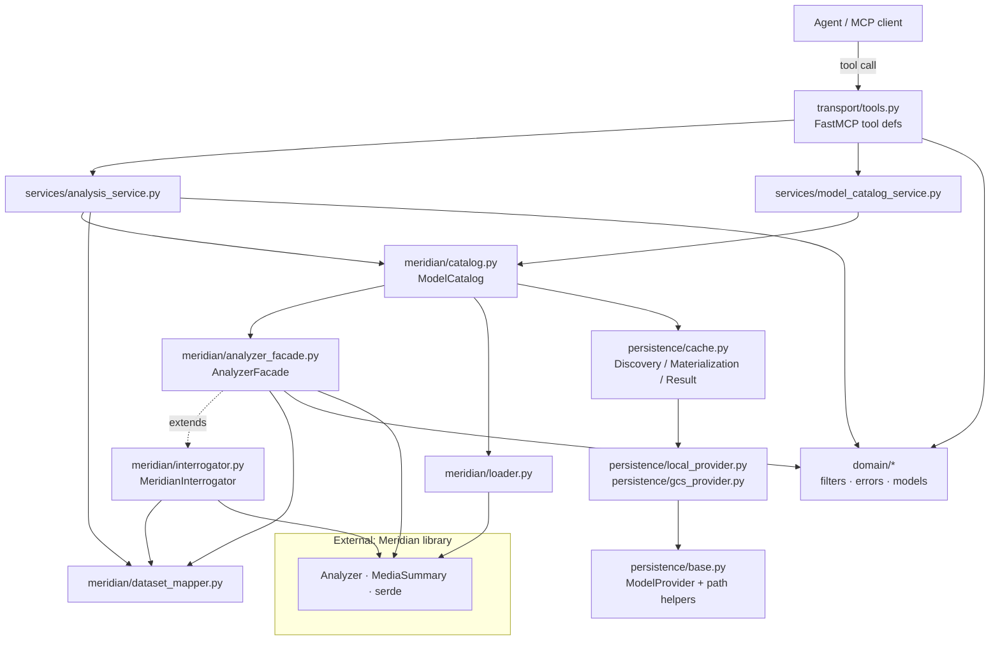
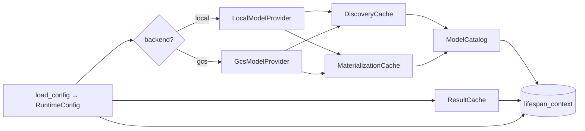
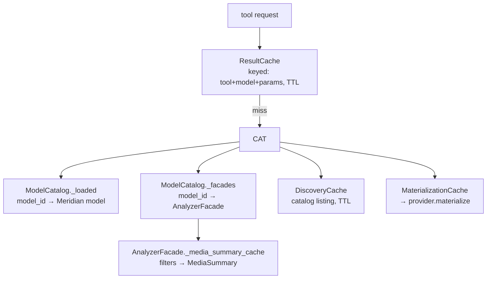
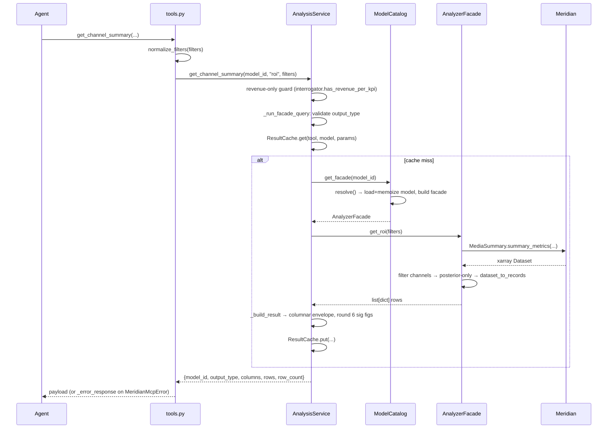
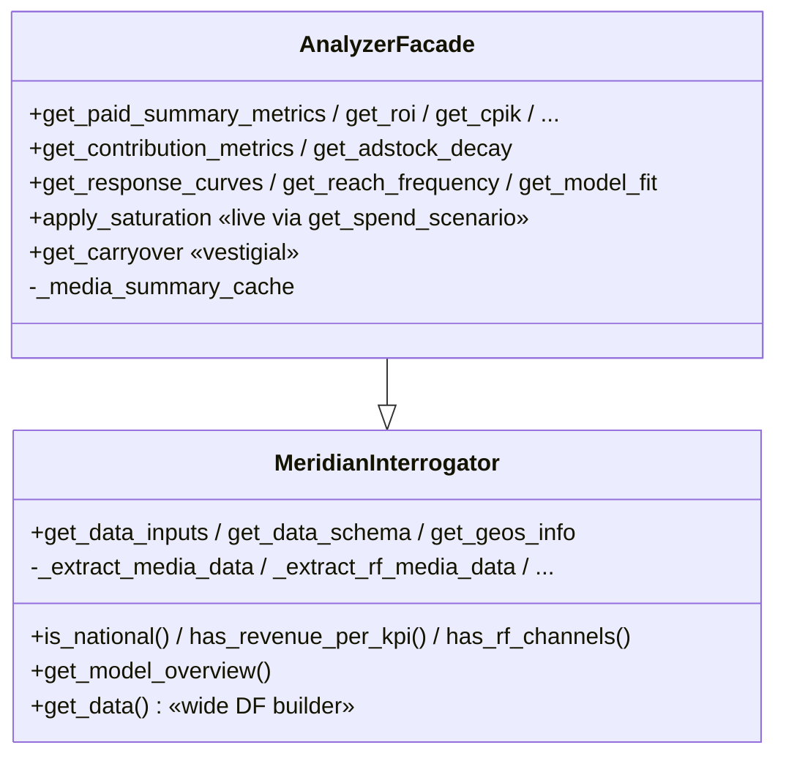
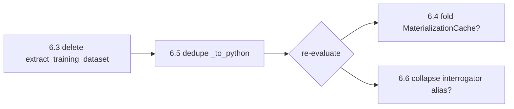

# Architecture Review — google-meridian-mcp

A structural survey of the MCP server: how the modules stack, how an
agent request flows through them, and where the design carries weight it
no longer needs. Source of truth for *intent* is [AGENTS.md](../AGENTS.md);
this document maps that intent onto the actual code and flags drift.

> Scope: only `src/google_meridian_mcp_server/` (~2,000 LOC of real code).
> `references/meridian/` is the vendored Meridian library — reference
> material, not our code — and is excluded.

---

## 1. The layer cake (high level)

The system is a thin transport shell over a service layer, which drives a
set of Meridian adapters, which sit on a persistence layer. Domain types
are shared by everyone.

**Layer responsibilities**

| Layer | Modules | Job |
|-------|---------|-----|
| Transport | `transport/tools.py`, `server.py` | Register FastMCP tools, build lifespan state, convert domain errors → error payloads. **No business logic.** |
| Services | `services/analysis_service.py`, `services/model_catalog_service.py` | Validate output-type/dataset selections, dispatch to adapters, shape the columnar envelope, integrate the result cache. |
| Meridian adapters | `meridian/catalog.py`, `analyzer_facade.py`, `interrogator.py`, `dataset_mapper.py`, `loader.py` | Resolve `model_id` → loaded model; extract metadata; run Analyzer/MediaSummary; convert xarray/pandas → JSON-safe rows. |
| Persistence | `persistence/cache.py`, `local_provider.py`, `gcs_provider.py`, `base.py` | Discover models in a backend, materialize them locally, cache discovery/results. |
| Domain | `domain/filters.py`, `errors.py`, `models.py` | Shared types: pydantic filter schema, error hierarchy, config + catalog-entry dataclasses, enums. |

The dependency direction is clean and one-way: **transport → services →
meridian → persistence → domain.** Nothing lower reaches back up. That is
the single best property of this design.

---

## 2. Object/instance wiring (who constructs whom)

Built once at startup in `server.py::_lifespan`, then stashed in
`ctx.lifespan_context`:

Per request, `transport/tools.py` builds a **fresh, cheap service object**
(`AnalysisService` / `ModelCatalogService`) wrapping the long-lived
`ModelCatalog` + `ResultCache` from the lifespan context. The expensive
state (loaded models, fitted facades) is memoized inside `ModelCatalog`
for the life of the process.

**Caching tiers (three independent layers):**

---

## 3. Request lifecycle (low level — one analysis call)

`get_channel_summary(model_id, "roi", filters)` end to end:

Every analysis tool follows this exact spine. The only variation is the
dispatch table inside `_run_facade_query` (output_type → facade method).

---

## 4. The two adapter "personalities"

`AnalyzerFacade` **extends** `MeridianInterrogator`. They are the *same
object* at runtime — `ModelCatalog.get_interrogator()` literally returns
`get_facade()`.

- **Interrogator** = read-only *metadata* about a fitted model (shape,
  channels, geos, time, schema) → feeds `get_model_overview`.
- **Facade** = *analysis* (Analyzer + MediaSummary), normalized to
  posterior-only JSON rows.

The split is conceptually reasonable (metadata vs. computation), but the
inheritance + the two-named-getter-for-one-object pattern is a mild smell
worth noting (see §6).

---

## 5. What's healthy

- **Strict one-way layering.** No upward imports, no cycles.
- **Errors are a first-class domain concern.** Single `MeridianMcpError`
  hierarchy with stable codes; one conversion point in `tools.py`.
- **Uniform tool spine.** Every analysis tool is
  `normalize → validate → cache → facade → columnar envelope`. Easy to
  reason about and to extend.
- **Caching is layered and purposeful** (result / model / facade /
  media-summary / discovery), each with a clear key.
- **Pluggable backends** behind a clean `ModelProvider` ABC; local vs GCS
  selected in one place.
- **Tests mirror the layers** (unit / integration / contract) plus the
  live validation matrix as an acceptance gate.

---

## 6. Simplification opportunities

Ordered by value-to-risk. Confidence noted. None of these change the tool
surface or response shapes — they remove weight behind the contract.

### 6.1 Partially-live "response-curve v1" path in the facade — UPDATED

`get_response_curves` / `get_response_curve_summary` (the live tools) call
`Analyzer.response_curves()` directly. An **earlier, manual** response-curve
implementation still sits in `analyzer_facade.py`. Its status has changed:

| Symbol | Lines | Live caller? |
|--------|-------|--------------|
| `apply_saturation` | ~310–380 | **`get_spend_scenario` (live)** |
| `get_carryover` | ~283–301 | none (only tests) |
| `_get_spend_column` | ~303–308 | only `apply_saturation` |
| `_interpolate_with_extrapolation` | ~489–522 | only `apply_saturation` |

`apply_saturation`, `_get_spend_column`, and `_interpolate_with_extrapolation`
are now **live** — they are the saturation engine that backs the
`get_spend_scenario` tool and are no longer deletion candidates.
`get_carryover` remains the one staged-but-unused method (no live caller).

### 6.2 Wide-DataFrame subsystem in the interrogator — UPDATED

`get_data()` and its eight private extractors
(`_build_population_df`, `_extract_media_data`, `_extract_rf_media_data`,
`_extract_organic_media_data`, `_extract_organic_rf_data`,
`_extract_non_media_data`, `_extract_controls_data`,
`_filter_data_by_date_range`) build a wide per-time/geo frame. The **only**
non-test caller is `apply_saturation`.

Because `apply_saturation` is now **live** via `get_spend_scenario` (see §6.1
update), `get_data` and its extractors are also live and are **no longer
deletion candidates**. The live data paths are `dataset_mapper.extract_channel_data`
(long table), `extract_training_datasets` (merged datasets), *and* this wide-frame
subsystem powering spend-scenario simulations.

### 6.3 Unused singular helper — HIGH confidence, trivial

`dataset_mapper.extract_training_dataset` (singular) has zero callers; the
codebase uses `extract_training_datasets` (plural). One-function delete.

### 6.4 `MaterializationCache` is a passthrough — MEDIUM confidence, low value

It holds a `cache_root` and forwards a single call to
`provider.materialize(entry, cache_root)`. The actual caching lives in the
provider. It earns its name only as a seam for the lifespan wiring; you
could fold `cache_root` into the catalog and drop the class. Minor —
keep if you value the symmetry with `DiscoveryCache`/`ResultCache`.

### 6.5 Duplicate `_to_python` numpy/pandas coercion — MEDIUM confidence, low value

Near-identical scalar-coercion helpers exist in both
`dataset_mapper._to_python` and `interrogator._to_python`. Consolidate to
one shared helper (in `dataset_mapper`, the more general one). If §6.2
lands, the interrogator copy may disappear with it — check before merging.

### 6.6 Interrogator/Facade inheritance — LOW confidence, judgment call

Because the catalog returns one object for both roles, the
metadata/analysis split buys separation-of-concerns in *source layout* but
not in *instances*. Options, in order of conservatism:
1. **Keep** (the split documents intent well) — fine, do nothing.
2. Drop `get_interrogator()` and have callers use `get_facade()` (they
   already get the same object) to remove the alias illusion.
3. Merge the two classes once §6.2 shrinks the interrogator. Only worth it
   if the file gets small enough to not warrant its own module.

### 6.7 `ModelCatalogService` thinness — LOW confidence, leave it

25 lines that serialize entries + ISO-format a timestamp. It's a real (if
small) responsibility and keeps `list_models` symmetric with the analysis
tools. Not worth merging into the catalog.

---

## 7. Recommended cleanup order

1. **6.3** — delete `extract_training_dataset` (singular); zero callers, zero
   contract impact.
2. **6.5** — dedupe `_to_python` as a tidy-up.
3. Pause and re-survey. **6.4 / 6.6 / 6.7** are taste-level; decide with
   the codebase in front of you.

Note: **§6.1 and §6.2 are no longer cleanup candidates.** `apply_saturation`,
`_get_spend_column`, `_interpolate_with_extrapolation`, and the wide-DataFrame
subsystem (`get_data` + extractors) are now live — they power `get_spend_scenario`.
Only `get_carryover` remains staged-but-unused.

The structure itself is sound — the layering is the kind you'd *want* to
arrive at. The remaining bloat is narrow: one dead method (`get_carryover`)
and a couple of minor helpers.
